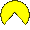
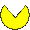

## GetYourBitcoins Game  

This is a game implemented in JavaScript using object-oriented programming principles such as classes and constructors. The game allows players to control a pacman that moves around the screen, eating bitcoins and avoiding Euros. The game ends after 90sec and the higher score is saved. The main goal is to increase the high score as much as possible in 90sec.


## How to Play

Use de direct link provided in GitHub or here.
https://joanlopezit.github.io/GetYourBitcoins/

- Use the arrow keys (up, down, left, right) to control the pacman's direction.

- The objective is to eat as much bitcoin as possible avoiding euros.

- Each coins randomly appair every 9secs.

- The game ends after 90sec.

- To restart the game, simply refresh the page or press start.


## Code Structure

The game is built using object-oriented programming concepts in JavaScript. Here's a brief overview of the code structure:

 ## index.html
- This is the main HTML file that displays the game grid and loads the necessary JavaScript and CSS files.

 ## style.CSS
- The CSS file contains styling for the game grid and other elements.

 ## Script.js
- The script.js file contains the game logic and call the classes. It also and handles user input. It is organized into the following classes:

 ## class snake
- This class represents the pacman in the game. It keeps track of the pacman's body, direction, and movement. It also handles collisions with the bitcoin.

 ## class fruit
- The Food class represents the bitcoin that appears randomly on the screen. When the pacman eats the bitcoin, it adds 100 points to the score.

 ## class venomousFruit
- The Venom class represents the euro that appears randomly on the screen. When the pacman eats the euro, it substrats 50 points to the score.

 ## class game
- The Game class manages the startGameScenario where the Start button is and the wrapper that englobes the game.

## Technologies Used

HTML5
CSS3
JavaScript (ES6)


## Browser Compatibility
The game has been tested and verified to work on the following web browsers:

- Google Chrome
- Mozilla Firefox
- Microsoft Edge
- Safari


## Acknowledgments
- The game has been build in less than 3 for educational purposes.
- At the beggining, it was ment to be a classic Snake game, however I had to change the game priorities due to a 
lack of time.


## Folders & Code presentation

This last part will explain how the game is organised and which are the logics that have been created in javascript
for making this game posible. We are going to also explain the HTML & CSS structure.

## Files organisation

The game has several files related to different funcitons and purposes:

1. Index.HTML
This file contains the main HTML structure of the game

2. style.CSS
This file contains the styles related to index.HTML

3. javascript files (game.js, index.js, snake.js, fruit.js, venom.js)
Those 5 different files contains the main structure of javascript.


## Code presentation

1. Index.HTML

The html is mainly composed of 2 divs in the body section nesting each one other child divs:

The first main div with the class .initial-screen nest a div with an image and another div with the start button and score.
the second main div is a wrapper that has the ingame details (scores) and the main grid called scenario.

2. style.CSS

In this part, we set the styling to the body in order to center de 2 main divs that contains. 
We also add some styling to get the buttons under the image with space between. We will also use space between for scores.

inside the wrapp, we have set display none in order to show the start menu and only start the game once the button is pressed. For the scenario with class .scenario, we have created a 30x30 grid where the game will take place.

As you can see, the concept is pretty simple, however it get more complex with javascript, as main elements such as
the player or the bitcoins will be added with javascript.

## game.js

this file contains the score and the start and game over function.
Those functions call the wrapper were the scenario is and the starterScenario, changing their display to none if we want to hide them. If gameOver, we show The startScenario. If we Start the game, we display de wrapper were the game is.

```javascript
class Game {
    constructor(){

        this.score = 0;
        this.wrapper = document.querySelector(".wrapper");
        this.startGameScenario = document.querySelector("#initial-screen")
        // this.gameIsOver = false;
    }

    start() {

        this.startGameScenario.style.display = "none";
        this.wrapper.style.display = "block";
    }
    gameOver() {

        this.startGameScenario.style.display = "block";
        this.wrapper.style.display = "none";
    }
}
```

## snake.js

      

This file contains the snake Class with all the values that give form to the pacman. 
The constructor defines all the parameters regarding its size and starter position.


It also calls the scenario and creates utilising DOM a new div inside the scenario. The pacman is now implemented in the scenario thanks to javascript with appendChild. 

```javascript
class Snake {
    constructor() {
        // Select scenario
        this.scenario = document.querySelector(".scenario")

        // Create player in DOM
        this.player = document.createElement("div");
        this.player.className = "snakeClass";

        // Add player to Scenario
        this.scenario.appendChild(this.player)
    }
  }
```


After setting an initial direction, a function with the name moveSnake will create a constant movement while facing a direction. We will use a switch with parseint and module, using the gridsize to calculate the movement.

```javascript
moveSnake() {
        switch (this.direction) {
            case "up":
                this.player.style.top = `${(parseInt(this.player.style.top) - this.gridSize + 390) % 390}px`;
                break;
            case "down":
                this.player.style.top = `${(parseInt(this.player.style.top) + this.gridSize) % 390}px`;
                break;
            case "left":
                this.player.style.left = `${(parseInt(this.player.style.left) - this.gridSize + 390) % 390}px`;
                break;
            case "right":
                this.player.style.left = `${(parseInt(this.player.style.left) + this.gridSize) % 390}px`;
                break;
            default:
                break;
        }

        // Call the moveSnake function again after a delay to create a continuous movement
        setTimeout(() => this.moveSnake(), this.movementSpeed);
    }
```
In order to create a loop to repeat the moveSnake, a setImeOut will be added, followed by an event Listener to set the keymove.

Those parameters will set the constant movement, however we will need another function to change the movement with our keyboard later in the script document.

## Fruit & VenomousFruit JS

     


I will explain those folders together as they have the same structure but different values. 

Here we are creating each a class with their constructor that gives them values. Those values and DOMS will create as we have seen before in the snake file the div inside the scenario, aswell as their styling.

However, the interesting point here is that the fruit has been created inside of a function called "CreateFruit" that will use an algorithm to spawn randomly a bitcoin inside the scenario. The algorithm collect the scenario size menus the size of the bitcoin and multiplies it randomly. Here is the code: 

```javascript
    const maxX = this.scenario.clientWidth - 90; // Ancho del escenario - ancho de la fruta
    const maxY = this.scenario.clientHeight - 90; // Alto del escenario - alto de la fruta
    const randomX = Math.random() * maxX;
    const randomY = Math.random() * maxY;
    
    // Set the left and top positions of the fruit based on the random X and Y positions
    this.reward.style.left = randomX + "px";
    this.reward.style.top = randomY + "px";

    // Add the fruit to the scenario
    this.scenario.appendChild(this.reward);
 ```
  
After creating a random fruit, we just have to check if there is a parentNode fruit and remove it to ensure that there is  only one bitcoin in game. We will use removeFruit function for that, creating an if statement that compares if there is a bitcoint in his parentNode. If there is, we will remove the parentNode Child with remove.child.


```javascript
  removeFruit() {
    // Check if the fruit element exists and has a parent node (i.e., if it is in the DOM)
    if (this.reward && this.reward.parentNode) {
      // Remove the fruit from the DOM by removing it from its parent node
      this.reward.parentNode.removeChild(this.reward);
    }
  }
```

## Script JS


The script is where all the logic happends and works. We first set the window Onload function that will contain the adventListener of the start button. We then Ensure that the startGame function is called displaying the game if start is clicked, then we also use a setIntervall that will end the game after 90sec. Here is the code: 

```javascript
window.onload = function () {
    console.log('SCRIPT JS IS WORKING');
    const startButton = document.getElementById("start-button");
    // const restartButton = document.getElementById("restart-button");
    let game;
    startButton.addEventListener("click", function () {
        console.log('START BUTTON IS WORKING');
        startGame();
        setTimeout(() => {
            console.log("IT HAPPENDS")
            game = new Game();
            game.gameOver()
        }, 60000);  

    });

    function startGame() {
        console.log("start game");
        game = new Game();
        game.start();
    }
}
```

After calling the snake, fruit and venomousFruit classes, we are going to set the most important fonction that will not only call the score result, but also all the colisions between pacman and other elements.

first we set a function named collissionDetection and we calculate the center coordinates of the player circle aswell as the fruit circle and venomousFruit circle.
Then we calculated the distance between the two circles using Mth.sqrt to then calculate the minimum thistance for a collision. 
Then we set that if the distance between the objects is lesser than de minimum distance for the colision, it trigers all the features (score,new fruit,sound etc)

```javascript
function collissionDetection() {

    // Calculate the center coordinates of the player circle
    const snakeX = snake.player.offsetLeft + snake.player.offsetWidth / 2;
    const snakeY = snake.player.offsetTop + snake.player.offsetHeight / 2;
    console.log(snakeX, snakeY)

    // Calculate the center coordinates of the fruit circle
    const fruitX = fruit.reward.offsetLeft + fruit.reward.offsetWidth / 2;
    const fruitY = fruit.reward.offsetTop + fruit.reward.offsetHeight / 2;
    // Calculate the center coordinates of the venom circle
    const venomX = venom.poison.offsetLeft + venom.poison.offsetWidth / 2;
    const venomY = venom.poison.offsetTop + venom.poison.offsetHeight / 2;

    // Calculate the distance between the two circles' centers
    const distanceFruit = Math.sqrt((snakeX - fruitX) ** 2 + (snakeY - fruitY) ** 2);
    const distanceVenom = Math.sqrt((snakeX - venomX) ** 2 + (snakeY - venomY) ** 2);
    // Calculate the minimum distance needed for a collision (sum of the radii)
    const minDistanceFruit = snake.player.offsetWidth / 2 + fruit.reward.offsetWidth / 2;
    const minDistanceVenom = snake.player.offsetWidth / 2 + venom.poison.offsetWidth / 2;

    // If the distance is less than the minimum distance, a collision is detected
    if (distanceFruit < minDistanceFruit) {
        console.log('Fruit Collision detected!');
        // Remove the fruit from the DOM and add a new one
        fruit.reward.remove();
        fruit.createFruit()

        // score manager
        score+= 100
        scoreElement.innerHTML = `Score : ${score}`
        highScore = score >= highScore ? score : highScore;
        localStorage.setItem("high-score", highScore)
        highScoreElement.innerHTML = `High Score : ${highScore}`
        const bitcoinSound = new Audio('./snake_images/BitcoinSound.wav');
        bitcoinSound.play()
        }
  }
```

To conclude, we just have to set the gameloop for the collision detection and the movement direction of pacman.

We create a function called playerMove that will set all the directions related to  the arrow keyboard with a switch case, followed by an adventEventlistener to triger playerMove.

```javascript
    // Function to move the player constantly
    moveSnake() {
        switch (this.direction) {
            case "up":
                this.player.style.top = `${(parseInt(this.player.style.top) - this.gridSize + 390) % 390}px`;
                break;
            case "down":
                this.player.style.top = `${(parseInt(this.player.style.top) + this.gridSize) % 390}px`;
                break;
            case "left":
                this.player.style.left = `${(parseInt(this.player.style.left) - this.gridSize + 390) % 390}px`;
                break;
            case "right":
                this.player.style.left = `${(parseInt(this.player.style.left) + this.gridSize) % 390}px`;
                break;
            default:
                break;
        }

        // Call the moveSnake function again after a delay to create a continuous movement
        setTimeout(() => this.moveSnake(), this.movementSpeed);
    } 
```


Thanks for reading this code and playing the game, it has been the first game created by me, looking forward to develop more projects.

But first, lets collect some bitcoins   

## Developper & contact details

Name: Joan Lopez Cameros
Email: joan.lopez.job@gmail.com


